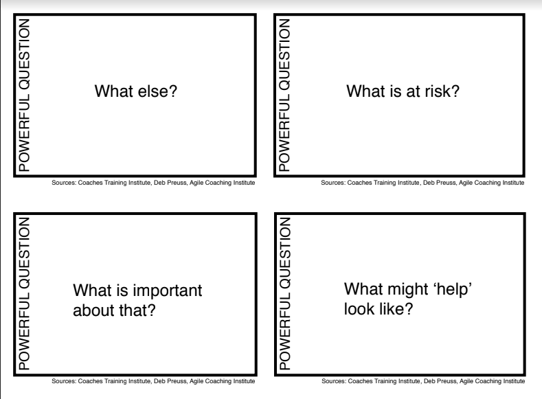

During week 3 of the [Agile Coaching Lab (ACL)](http://www.agilecoachinglab.com/) we focused on the craft of coaching. We explored many tools, techniques, and strategies, but the three that stuck with me were all question asking techniques, therefore I'd like to unpack them briefly here.

## GROW Coaching Model
The GROW model is a popular framework for coaching people or teams towards a goal. GROW is an acronym for four key stages: _Goal_, _Reality_, _Options_, and _Way Forward_.

The acronym also suggests a flow for the coaching conversations where the first stage is to establish a goal. You as the coach help the coachee define what they want to achieve through asking questions like: "What are you looking to achieve?", "What do you want to get out of this meeting?", "What's the bigger picture?".

In the second stage, the coach encourages coachee to examine the current reality of their situation. This involves helping them take an honest and objective look at the current situation and asking questions like: "What is the current situation?", "What are the internal/external obstacles?".

In the third stage, the coach helps the coachee generate for achieving their goal. This involved a lot of open questions and tongue biting so that you don't slip into advice mode. Some of these questions might be: "How would you tackle this if time wasn't a factor?", "What options appeal to you right now?", "What else could you do?".

Then, finally, in the fourth stage, the coach guides the coachee towards making an action plan. It is important to encourage accountability and commitment by asking questions like: "What will you do now?", "When will you do it?", "How committed are you on a scale of 1 to 10?". I quite like the grow model as you can have fun with it by looping back to a previous section if you get stuck or even starting again entirely if the conversation drifts in another direction.

## Powerful Questions

Powerful questions are a set of open-ended questions that are designed to promote thinking, reflection, and space for thought. These types of questions help coachees discover new possibilities and solutions without pushing the coaches agenda on them.

Powerful questions usually begin with words like "what," "how," or "why" and are phrased to be curious, creative, and reflective. They can often challenge assumptions, be slightly uncomfortable, encourage creativity and growth.

Some examples of powerful questions include:
- What are your biggest challenges right now?
- What is at risk?
- Why is this issue important to you?
- What is stopping you?
- How does it look to you?

Powerful questions are a quite popular tool for coaches but I find them a bit awkward to use at the moment and prefer the "Clean Language" questions and the simple "And What Else" question but as I mature as a coach this might change.

## Clean Language

Clean Language is a question technique that was developed by psychologist David Grove. It is designed to explore a coachaee's thoughts, beliefs, and experiences in a non-judgmental and non-leading way.

The key part of Clean Language is the use language that is "clean" and free of assumptions, mis-interpretations, and bias. The questions are designed to be open-ended, neutral, and focused on using the individual's own words and experiences in a constructive way without the influence of the coach.

Some examples of Clean Language questions include:
- "What would you like to have happen?"
- "And what kind of [X] is that [X]?"
- "Is there anything else about that [X]?"
- "What needs to happen for that to happen?"
- "And what happens next?"
- "Can that happen?"

I prefer Clean Language over powerful questions as they seem less forceful and direct and they seem to encourage the coachee to explore their own experiences and develop their own insights and solutions more naturally.

## The Advice Monster!
One final cool thing that Jakub shared with us...



Thanks for reading.
