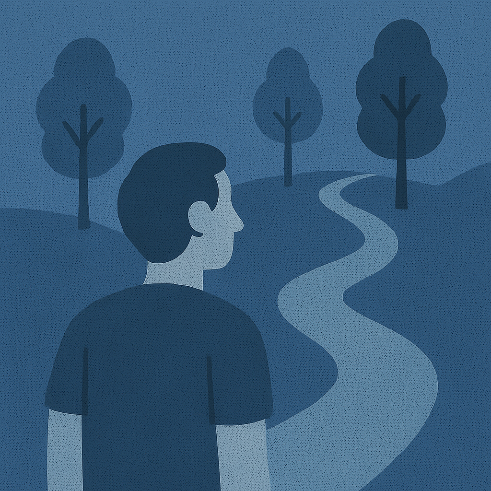

As the [Agile Coaching Lab (ACL)](http://www.agilecoachinglab.com/) draws to a close, I am filled with a sense of happiness and gratitude for being part of this beautiful cohort. ACL is a transformative program has allowed me to gain a deep understanding of coaching and leadership methodologies, principles, and the vital role of a coach in guiding people, teams, and organisations towards success. It also gave me a mirror through which i could reflect on myself, my paradigms, my biases, and my ambitions.

The lab sessions were led by [Jakub](https://www.linkedin.com/in/jakubjurkiewicz/) but the weekly group work activities provided a unique opportunity for me to engage with a cohort of diverse and talented leaders in the field of Agility. Through the interactive sessions and group discussions, I was able to explore different scenarios, techniques, and challenges that coaches face and to learn from the experiences and advice of my fellow participants.

In my journey through the Agile Coaching Lab, I have come to appreciate the importance of trusting yourself and your coachees and of continuous learning and growth as a coach. The field of Agile coaching is ever-evolving, and by the end of the lab there was a general feeling that world of Agile coaching is merging into the world of personal/general coaching more broadly and so staying up-to-date with the latest trends and best practices is crucial to ensure that we can provide the best guidance and support to our coachees.

Some prompts provided by [Jakub](https://www.linkedin.com/in/jakubjurkiewicz/) for our reflection were:

## What is the one thing that you learned and now believe every agile coach should know?

You will doubt yourself, you will doubt the techniques you read or learn about, and you will doubt if these techniques even work - be brave and just go for it. Your doubts are a reflection of yourself not the techniques nor of your coachees. Embrace your mindset of experimentation and try it, fail together, learn and try again. It is scary but you will be okay.

## What are the things that you have already tried?

Check in - I got my teams to start checking in and it totally changed the dynamic of meetings and attention.

"And What Else" - i use this a lot more than i expected. i've started to see opportunities to ask this every day.

## What are the things you learned about yourself?

The imposter syndrome is strong with me - I am quite hard on myself and I should be kinder to myself.

## What are the things you learned from the collaboration with others?

Everyone is trying their best to do the right thing. They are all trying to thrive in the forest and that given the right conditions they will thrive. I just try to help them discover what those conditions are… This comes from a poem [Jakub](https://www.linkedin.com/in/jakubjurkiewicz/) shared with us:

<blockquote>

When you go out into the woods and you look at trees,

you see all these different trees.

And some of them are bent, and some of them are straight,

and some of them are evergreens, and some of them are whatever.

And you look at the tree and you allow it.

You appreciate it.

You see why it is the way it is.

You sort of understand that it didn’t get enough light,

and so it turned that way.

And you don’t get all emotional about it.

You just allow it.

You appreciate the tree.

The minute you get near humans, you lose all that.

And you are constantly saying,

‘You’re too this, or I’m too this.’

That judging mind comes in.

And so I practice turning people into trees.

Which means appreciating them just the way they are

</blockquote>

_Ram Dass - [https://www.ramdass.org/ram-dass-on-self-judgement/](https://www.ramdass.org/ram-dass-on-self-judgement/)_

## What do you want to keep doing?

Blogging.

## What are the things that you are afraid to try?

Failing, wasting people's time, looking foolish...

## What do you want to stop doing?

Hesitating.

## What is your north star?

Care personally - challenge directly.

Overall, participating in the Agile Coaching Lab has been an enriching experience that has transformed my understanding of coaching, teaching, and leadership. The knowledge and insights I have gained will undoubtedly assist me on my journey as a leader and coach, and I am excited to continue learning and growing in this dynamic field.

Thanks for reading.
