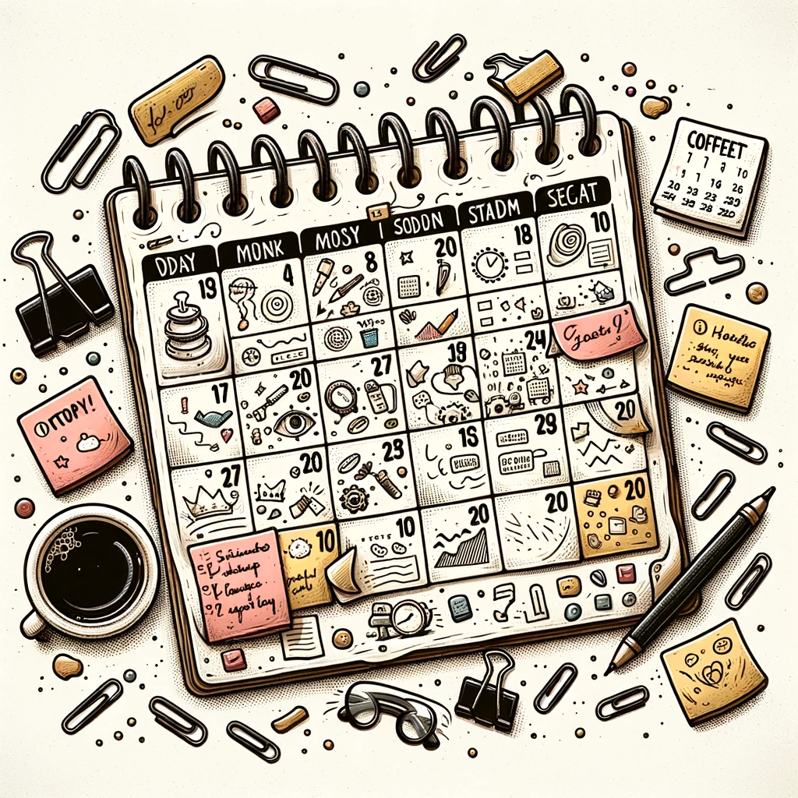

I've always liked productivity apps - Things, OmniFocus, TickTick. There's a particular kind of relief that comes from dumping everything floating around in my head into one tidy list and knowing nothing's been forgotten. That moment of clarity is genuinely satisfying.

But over time, I noticed a pattern: those lists just kept growing. And growing. Until the apps themselves became this unmanageable backlog of obligations. I'd try to prioritize, follow whatever system the app supported, but it didn't matter. The sheer volume of tasks turned the whole thing into a source of stress. Not a tool but a burden.

It all clicked one day when I found myself staring at seven pages of to-dos and asking: is the problem me, or is it the app? Turns out it was neither, exactly, but my system itself did have a fundamental flaw. These apps let me (encouraged me, really) to keep adding things, endlessly. No constraints. No reality check. Just more and more tasks with no reference to how much time I actually had in a day... week... year... That's not planning, it's wishful thinking, and eventually it just collapses under its own weight.

The turning point came during a chat with a friend - we were chatting about how much time we spent on different categories of work. That conversation flipped a switch. I realized i'd been thinking about tasks in isolation when I should have been thinking about the time for a task - not the task itself.

### Using a Calendar as a To-Do List

So I started using my calendar to block out time for everything I needed to do. Every task, no matter how small, got a slot. It was confronting at first - suddenly I had to reckon with two hard truths: how long things would take, and how many hours there actually are in a day. No more illusions. Just the simple math of time.

It changed everything. Tasks I would've added reflexively? I started letting go of them, because they clearly weren't worth the time they'd take. The calendar became a filter — and a pretty effective one.

### Why It Works

**1. Reality Check**
The calendar doesn't lie. You want to do something? Find a time slot. If you can't, maybe it’s not that important or maybe something else has to move to make space for it.

**2. Forced Prioritization**
There's only so much you can fit in a day. Blocking time makes that unavoidable and in your face. You can't just stack tasks on top of each other anymore. You have to make choices.

**3. Clarity**
Every task has a place. No more ambiguity, no more juggling. I can see my day, my week — and I can tell my team exactly when I'll get to their request because it's already scheduled.

**4. Less Stress**
The infinite scroll of a to-do list is gone. What's left is a finite day. I don't wake up wondering what I'm supposed to be doing — it's all right there.

**5. Flexibility**
Of course, things come up. So I leave space — at least half the day — open. If I don't, one unexpected task throws the whole system out. Rescheduling becomes a mess. The 50% rule keeps the calendar functional and not fragile.

### The Nuts and Bolts

**Time Estimation**
I pulled tasks from old to-do lists and email (most of my tasks come from email) and started estimating how long they'd take. I was way off at first, but I got better with practice.

**Scheduling**
In essence, i think of this as just booking a meeting with yourself. I already keep parts of my week blocked for deep work and recurring meetings, so I fit tasks into those existing structures. It's not perfect, but it works for now.

**The 50% Rule**
This part is, i have learnt, is a non-negotiable. Don't fill the whole day. Keep half of it open. If you don't, one disruption and the whole thing collapses in on itself. With 50% control over your time, the system holds.

**Consistency & Updates**
I keep my calendar open and my email closed (as much as possible... i stuggle with this one...). That helps me focus on what I said I'd do — and gives me the flexibility to adapt when things shift.

**Daily Review**
At the end of the day I check in with what actually got done. I like to do this is a short audio-note to myself that is auto-transcribed by an AI application. If something slipped i move it to a new timeslot. If I underestimated how long something took I make a note for next time. The review is where the system gets smarter.

{width=300 fig-align="center"}

### Not a New Idea

This isn't original. Time blocking, time budgeting — pick your term — has been around forever. [Cal Newport](https://calnewport.com/) talks about it. [Stephen Covey](https://en.wikipedia.org/wiki/Stephen_Covey) wrote about it. The best match to how i do it is probably from [Sam Corcos](https://www.levelshealth.com/podcasts/sam-corcos-ceo-co-founder-of-levels). He lays it out well in [this post](https://www.mgmtideas.com/ditch-your-to-do-list-and-use-your-calendar-instead/) and [this podcast](https://tim.blog/2023/09/20/sam-corcos/). I’m not reinventing anything. I’ve just found a version of it that works for me.

Thanks for reading.