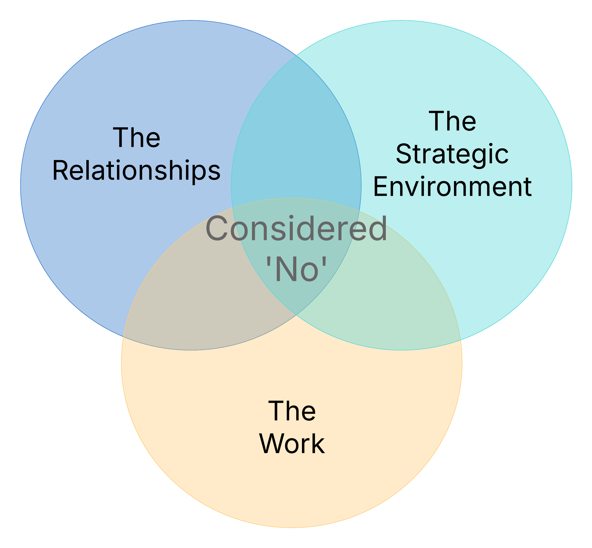

In a recent mentoring chat, someone asked me "How do you say no without pissing people off?". It's a good question - and i'm finding a common one. It reminded me of a concept I first came across through the wonderful coach [Leah Sertori](https://www.linkedin.com/in/leah-sertori-87154021/): the "Considered No". I'm sharing my flavour of it here in case it's useful to you too.

In the applied sciences urgent requests come with the territory. Colleagues want input, managers present you with new opportunities, users are chasing answers to today's urgent problem. If you're doing meaningful work in this space you'll never lack for things to do or to say yes to.

And of course, we all want to help. We care about being useful and doing useful work. But here's the thing: every 'yes' comes at a cost. Say 'yes' too often and you will find your actual core work - the work you're uniquely placed to do - start slipping off the radar.

The trap is subtle but real. Saying 'yes' feels like collaboration. It feels like the right thing to do. But over time, it dilutes our focus and fragments the intent behind your science. A couple of short tasks here, an "quick" analysis there, and a month later your actual research work hasn't moved.

There's a better way. Not a hard NO  - but a considered one.

{width=300 fig-align="center"}

The "considered no" isn't reactive. It's a deliberate, structured process - one that weighs the requests across three critical dimensions:
- Work program: What are the deliverables and priorities you are already committed to?
- Strategic alignment: How does this fit into broader goals - yours, the team's, the organisation's?
- Relationships: What's the best way to maintain trust, both with the person asking and the users you're ultimately serving?

When you approach decisions this way, the 'no' (if it turns out to be one) still honours the request. It says to the asker: "This matters and i've taken it seriously."

Let's look at a practical example. Suppose you're asked to drop into an urgent project that sits outside your current scope of work. Rather than a flat-out 'no', a considered response might look like:

> "I can see why this analysis is important. Would it be okay if we map it against our current priorities together? Right now, i'm focused on delivering [X], which supports [Y (hopefully a user, project, or mission)], and if I switch now we might be delaying [Z]. Is that okay or could another team/person be better placed for this? Or perhaps I could return to it once [X] is out the door?"

It helps to do this in a visible way with the asker as soon as possible - a whiteboard, shared doc, whatever works for where you are. The act of mapping trade-offs _together_ shifts the dynamic. The asker leaves knowing that you've listened and that their needs were actually taken seriously.

When you practise the Considered No it:
- respects the person and their request
- protects focus on high-impact work
- keeps effort aligned with strategy/priorities
- builds trust through transparency
- fosters a culture where saying 'yes' signals an actual commitment - not just willingness or helpfulness.

This isn't about stonewalling or hiding behind busyness. It's about stewardship - of time, of trust, of your mission. A 'considered no' is, in fact, an invitation: Let's think through this together. Sometimes the answer is 'yes'. Sometimes not. But either way, it's intentional.

Thanks for reading.