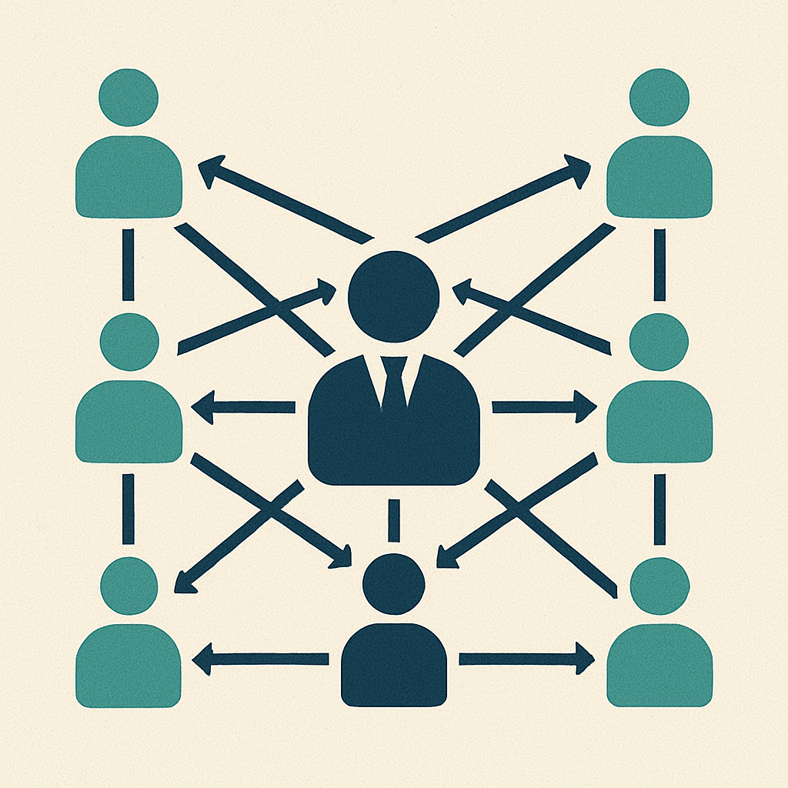

Over the past few years, i've noticed a significant improvement in morale and effectiveness when decision-making is decentralized - meaning that those involved in the daily work, closest to the work, are empowered to have a greater say and actually make most decisions. This approach is grounded in my exploration of ["lean" principles](https://en.wikipedia.org/wiki/Lean_thinking): which prioritize autonomy, mastery, and knowledge and expertise at every level of the organization.

## Leveraging Expertise

For me, the initial step was to trust my team members to make informed decisions based on their expertise. Recognizing and utilizing the depth of knowledge within the team led to more nuanced and rich outcomes that often were very different and more well rounded than anything i came up with on my own.

The hardest part was holding my tongue and letting the discussion/decisions play out - or [Taming My Advice Monster](https://www.ted.com/talks/michael_bungay_stanier_how_to_tame_your_advice_monster?language=en), as [Michael Bungay Stanier](https://www.mbs.works/about/) might say...

## Innovation

The surprising part has been that by presenting a team with autonomy turned every team i tried it with into a hub of innovative ideas, that spawned free thinking conversations and also fostered an ownership of work that was previously thought to be 'driven from the top'.

## Be Agile, Don't Do Agile

This approach to decision making allows for true agility. Agility in my mind is the ability to adapt quickly to the changing landscape of our projects and of our team dynamics. By encouraging the people with the most information to make decisions, decision-making became more fluid, resulting in faster adaptations and faster work.

## Trust

A culture of trust and ownership developed in all the workplaces where this type of mindset was embraced. Everyone took responsibility for their work and felt empowered to suggest changes knowing that they had a say in how the team worked and an experiment to change how we worked was a simple as a discussion and a lab team vote away.

{width=300 fig-align="center"}

In retrospect, adopting decentralized decision-making not only improved my management experience but is has also cultivated a culture of excellence, unlocking the existing talents and ideas in people that were otherwise ignored. I strongly suggest you give it a try - start small, like deciding what time to hold your regular team meeting... try doing it with a team vote rather than the team leader suggesting a time.

Thanks for reading.