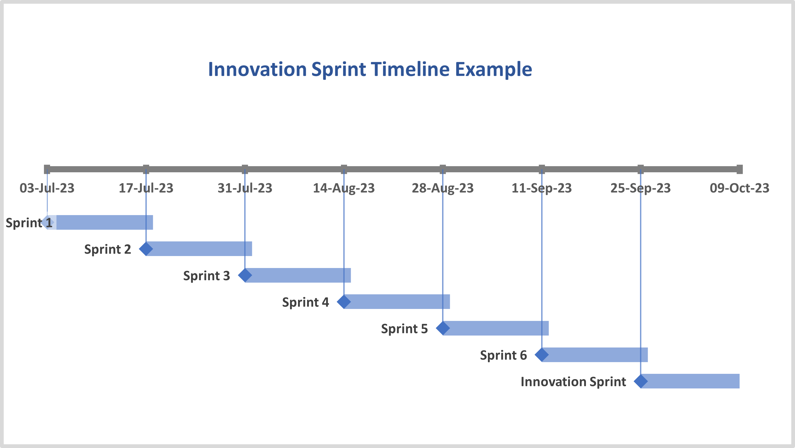

People have been asking me how they can get started with Innovation Sprints, so I've put together a quick start guide on how to do your first Innovation Sprint with your team.

{width=300 fig-align="center"}

1. **Get on the same page** - meet with your pm and your team and discuss that you want to trial an Innovation Sprint and that at the end you will be asking them to vote on doing one again. Discuss when a good time would be to do a two-week sprint. Keep in mind that there is never a 'right' or 'good' time and you will just have to commit to it knowing that some things might get in the way or be delayed a little - this is okay.

2. **Set the guardrails** - Hold a team meeting on day 1 of the Innovation Sprint for 15mins. Outline the rules of the game and ask what questions folk have. Rules of the game are:
- Keep it Relevant – What we choose to do during the Innovation Sprint should be relevant to our organization. Taking a pottery course might be a fun and creative endeavour, but it's important to save that for the weekend and focus on ideas that can truly benefit our research work/organisation during the Innovation sprint.
- Opting for Regular Work is Okay – Understand that some people find it difficult to step away from project work and may feel guilty or like they’re neglecting their responsibilities. Make it clear that people can choose to continue with regular project tasks during the Innovation Sprint, that’s entirely up to them.
- To Demo or Not to Demo – At the end of the Innovation Sprint, you will have a sharing session where folks can reflect on the sprint and demo or share what people have been working on. However, sharing is not a requirement. The goal of the Innovation Sprint is not to produce a new product or new research paper, but rather to give you space to think, innovate, try new things, and fail fast. The goal is learning and the creative journey, not the destination. Don't make it about doing more, make it about having fun.

3. **Get out of the way** - Seriously, cancel all meetings for the next two weeks. I know this is hard, but really really try to avoid all meetings for at least a full week.

4. **Reflect** - Hold a 30 or 45 min (depending on team size) reflection meeting on the last day of the Innovation Sprint. This is where you ask if anyone wants to share or discuss what they did. You can run this as an agile retrospective if you like but it really depends on your teams culture and what they're comfortable with. During this meeting it is important to get the team to vote on doing this again or not. I like [roman voting on three](https://appliedframeworks.com/blog/the-roman-voting-technique-for-agile-teams) for this. If you don't get a "yes" then have a discussion about why and unpack what the team got, or didn't, from this experience.

5. **Repeat** - If you got a yes, schedule the next Innovation Sprint for about 10 or 12 weeks from now - but check in with what else is happening in calendars at that time to and always be flexible.

Here is an example of a schedule of Innovation Sprints I use with my team:

{width=600 fig-align="center"}

One final note... Please resist the urge to do a one week Innovation Sprint - two weeks is needed and the time will fly. Try it once for two weeks and see what happens.

Thanks for reading.