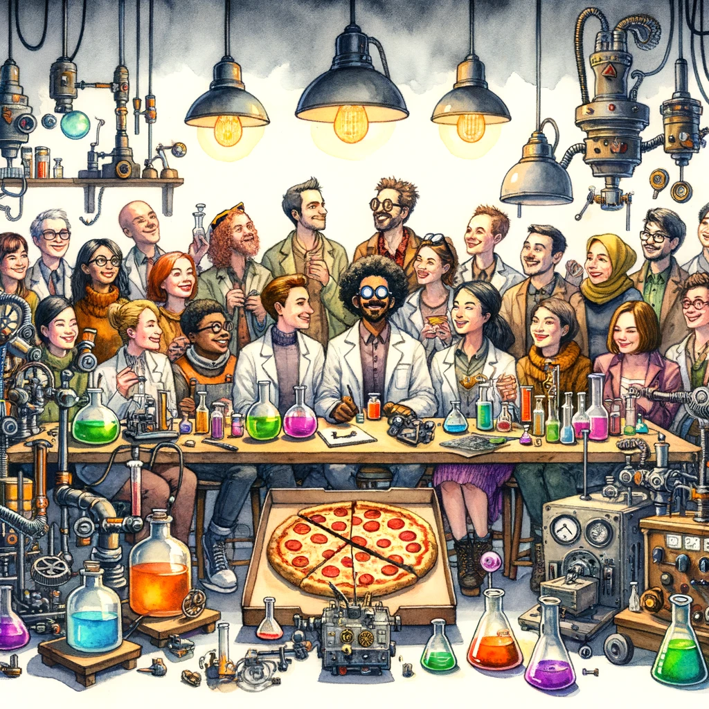



"Innovation is free pizza and an unsupervised workshop" - the moment I heard this quote from Saul Griffith's it captivated me. I am a career scientist and Saul's statement clearly articulated what innovation and invention means to me. I've been trying to communicate this to people i know and work with and until now i don't think i have succeeded - this blog is my attempt to unravel this quote and to unpack this recipe for creating groundbreaking ideas and innovations.

## Free Pizza: Addressing Foundational Needs

As Saul points out, at its core, "free pizza" symbolizes the basics. The necessities like pay, safety, and security being met upfront. This draws parallels with Maslow's hierarchy of needs, and states that before diving into advanced cognitive work like creativity and innovation, the foundational needs must be met. When scientists aren't burdened by concerns for their livelihood (i'm looking at you grant/funding cycle and the casualisation of the work force...), they're better positioned to channel their energies towards innovation. The 'free pizza' speaks of creating an environment where such primary needs are addressed, setting the stage for higher-order thinking.

It also just means free pizza.

## Unsupervised Workshop: Escaping Bureaucracy and Red Tape

The "unsupervised workshop" bit paints a picture of a space unburdened by the restrictive oversight of 'adults' - for me the 'adults', as Saul points out, are bureaucracy, project deadlines, and cumbersome processes. Removing these things promotes an environment of autonomy and encourages the experimentation that leads to mastery.

In numerous organizations, layers of bureaucracy and restrictive protocols squash the innovative spirit. The idea of an 'unsupervised workshop' emphasizes the need to peel away these layers, giving scientists the leeway to explore ideas without continually navigating the bureaucratic maze or awaiting myriad approvals.

{width=300 fig-align="center"}

## Striking the Balance Between Direction and Autonomy

While providing a free rein is essential for innovation, a complete lack of any structure at all could lead to disarray and waste in an organisational setting. This is where the challenge lies: in achieving a balance that equips innovators with tools, resources, and a modicum of direction while ensuring they have ample freedom for exploration.

So how do we walk this line. Well, Saul's sentiments offer valuable takeaways for today's organizations looking to foster creativity and innovation:

- **Prioritize Basic Needs:** Before steering towards innovation, ensure employees' fundamental concerns, such as fair pay, security, and a harmonious environment, are met. With these in place, minds are liberated to delve into creativity.

- **Reduce Red Tape:** Cultivate environments where people can operate unhampered by stifling procedures or bureaucracy. Permit them to experiment, refine, and fast-track their innovative endeavors without worrying about the need for pre-approval.

- **Foster Autonomy within a Shared Vision:** While championing the freedom to innovate, also instill a shared vision that aligns individual pursuits with the broader organizational mission.

## Conclusion

<blockquote>
"Remember kids, the only difference between screwing around and science is writing it down" Alex Jason via Adam Savage
</blockquote>

Thanks for reading.