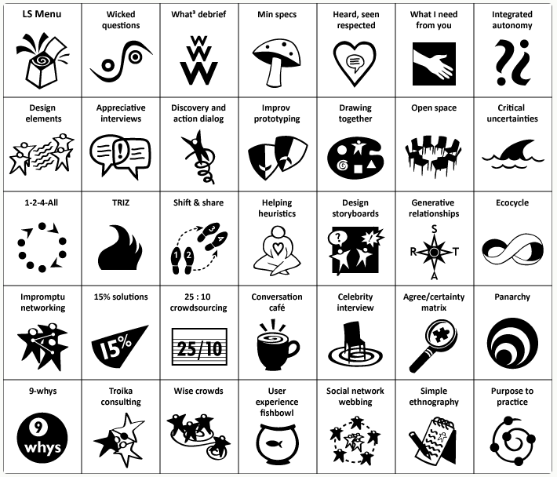

Do you struggle to get people on the same page or with effective cross team collaborations?

Have you heard of [Liberating Structures](https://www.liberatingstructures.com/)? Developed by Henri Lipmanowicz and Keith McCandless, [Liberating Structures](https://www.liberatingstructures.com/) are a collection of group facilitation methods grounded in complexity science that aim to empower every member of the group and harness collective intelligence for better outcomes.

Unlike traditional facilitation methods, [Liberating Structures](https://www.liberatingstructures.com/) promote a distributed leadership approach and adaptability to diverse contexts - from small team meetings to large conferences.

There are over 30 [Liberating Structures](https://www.liberatingstructures.com/), each designed to address a different aspect of group dynamics.

Some of the most popular structures include:

- [Open Space Technology](https://www.liberatingstructures.com/25-open-space-technology/): A structure for organizing large group meetings that allows participants to self-organize around topics of interest.

- [1-2-4-All](https://www.liberatingstructures.com/1-1-2-4-all/): A structure for generating ideas and sharing them with the group, which involves individuals first brainstorming on their own, then sharing in pairs, then in groups of four, and finally with the whole group.

- [Impromptu Networking](https://www.liberatingstructures.com/2-impromptu-networking/): A structure for connecting individuals with others who have similar interests or expertise.

- [Troika Consulting](https://www.liberatingstructures.com/8-troika-consulting/): A structure for helping individuals work through a problem or challenge by soliciting feedback and ideas from two other individuals in the group.

- [Wicked Questions](https://www.liberatingstructures.com/4-wicked-questions/): A structure for exploring complex or controversial issues by reframing them as questions that challenge assumptions and provoke discussion.

These are examples of structures that facilitate self-organization, brainstorming, networking, problem-solving, and critical discussions.

[Liberating Structures](https://www.liberatingstructures.com/) have been gaining popularity across various fields, including education, business, and government, but especially for organizations that prioritize collaboration, innovation, and inclusivity.

If you are interested in learning more, check out the Liberating Structures website [https://www.liberatingstructures.com](https://www.liberatingstructures.com) or the book ["The Surprising Power of Liberating Structures" by Lipmanowicz and McCandless](https://www.liberatingstructures.com/bookstore/).

Thanks for reading.