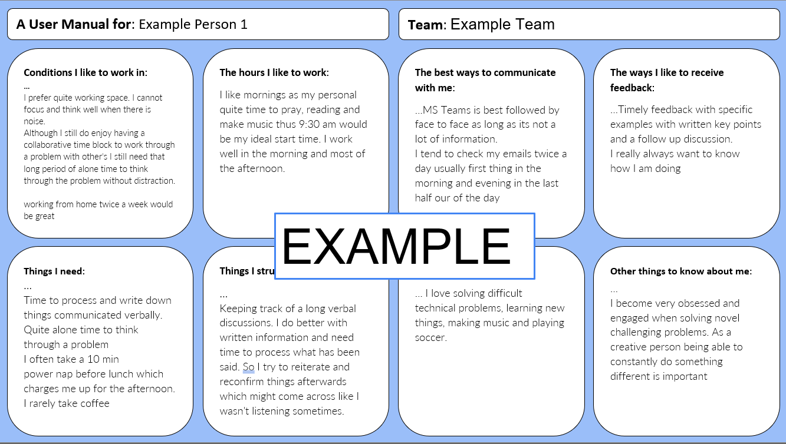

Have you ever tried to assemble a piece of Ikea furniture without instructions? That exasperating feeling of not knowing where to start, the recurring thought of "If only I knew how this works!" is a good metaphor for new teams trying to understand each other and how to build effective relationships. This is where Personal User Manuals (PUMs) comes in.

## Decoding the Personal User Manual

A Personal User Manual is an 'About Me' page, but for work. It's a snapshot of your working style, preferences, quirks, and values - all bundled into a neat, accessible guide for your team. This is not about broadcasting personal secrets, fetishes, or whims. Instead, it's a practical, professional tool to bridge gaps in understanding and accelerate team synergy.

## A Catalyst for New Teams

In the early stages of team-building, understanding how each member ticks can be a time-consuming, often frustrating process. Personal User Manuals come to the rescue by providing a cheat sheet for understanding your colleagues.

Imagine knowing right off the bat that Xiao thrives on quick Slack responses, while Emily prefers detailed emails. This eliminates guesswork and miscommunication, saving precious time, energy, and frustration.

## The Role of Personal User Manuals in Crafting Team Culture

The beauty of PUMs isn't just their operational advantage; it's their innate power to shape a vibrant, inclusive team culture. They foster an environment of transparency and empathy, encouraging open conversation about individual needs and preferences.

The simple act of creating a PUM nudges individuals towards greater self-awareness. Simultaneously, reading other's PUMs sparks empathy and understanding, sowing the seeds of a positive team culture.

## Guidelines for Drafting Your own Personal User Manual

So, how do you make your own PUM? The journey towards crafting a useful Personal User Manual begins with introspection and concludes with sharing this newfound knowledge with your team. Here's a simplified roadmap to help you on your way:

1. **Reflect:** Ponder your working style, communication preferences, peak productivity hours, and the circumstances under which you do your best work.

2. **Identify:** Pinpoint what motivates you, your core professional values, and how you handle stress or pressure.

3. **Compile & Share:** Write these insights in a clear, concise manner. Your manual should be an authentic reflection of your professional self, so don't be afraid to infuse it with your personality. I like to use a shared slide deck to do this – as inspired by my Agile Coaching Lab cohort – and so i've included a template for you at the end of this post to get you started.

4. **Evolve:** Your manual should be a living document that evolves as you grow professionally. Make sure to schedule time every 6 months or so to review and revise it with your team.

Incorporating Personal User Manuals into the building and shaping of your team is a strategic move towards effective communication and collaboration. By creating and sharing PUMs, you foster a work environment where everyone feels heard, understood, and respected.

[PUM TemplateDownload](pum_template_june2023.pptx)

Thanks for reading.