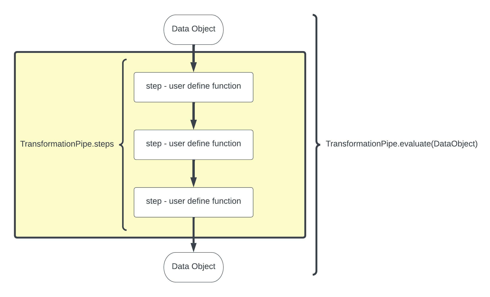

In Data Science or Data Engineering you constantly hear term “data pipeline”. But there are so many meanings to this term and people often are refering to very specific tools or packages depending on their own background/needs. There are pipelines for pretty much everything and in Python alone I can think of [Luigi](https://luigi.readthedocs.io/en/stable/), [Airflow](https://airflow.apache.org/), [scikit-learn pipelines](https://scikit-learn.org/stable/modules/generated/sklearn.pipeline.Pipeline.html), and [Pandas pipes](https://pandas.pydata.org/pandas-docs/stable/reference/api/pandas.DataFrame.pipe.html) just off the top of my head - [this article](https://towardsdatascience.com/data-pipelines-what-why-and-which-ones-1f674ba49946) does a good job of helping you understand what is out there.

It can be quite confusing especially if you want a simple and agnostic pipeline that you can customize for your specific needs with no bells and whistles or lock-ins to libraries etc. That is where PyDuct comes in. It is for the data engineer who just wants to get stuff done in an ordered and repeatable way.

PyDuct is a simple data pipeline that automates a chain of transformations performed on some data.

PyDuct data pipelines are a great way of introducing automation, reproducibility, structure, and flow to your data engineering projects.

### What is it?

The PyDuct transformation pipelines use user defined transformation functions linked together into a TransformationPipe. The key feature of PyDuct is that the datasource passed in can be almost anything that you desire - e.g. a pandas dataframe, a geopandas dataframe, and iris datacube, a numppy array, so long as your transformation steps read and write the same object PyDuct will work for you.

## Where to find out more:

PyPi Package: [https://pypi.org/project/pyduct/0.0.1/](https://pypi.org/project/pyduct/0.0.1/)

GitHub Repo: [https://github.com/RobTheOceanographer/pyduct](https://github.com/RobTheOceanographer/pyduct)

Docs: [https://robtheoceanographer.github.io/pyduct/](https://robtheoceanographer.github.io/pyduct/)

PyDuct was made by me and [Alexander Kozlov](https://alexkozlov.com/) and [Mohammadreza Khanarmuei](https://www.linkedin.com/in/mohammadreza-khanarmuei-437a3163)

Thanks for reading.
