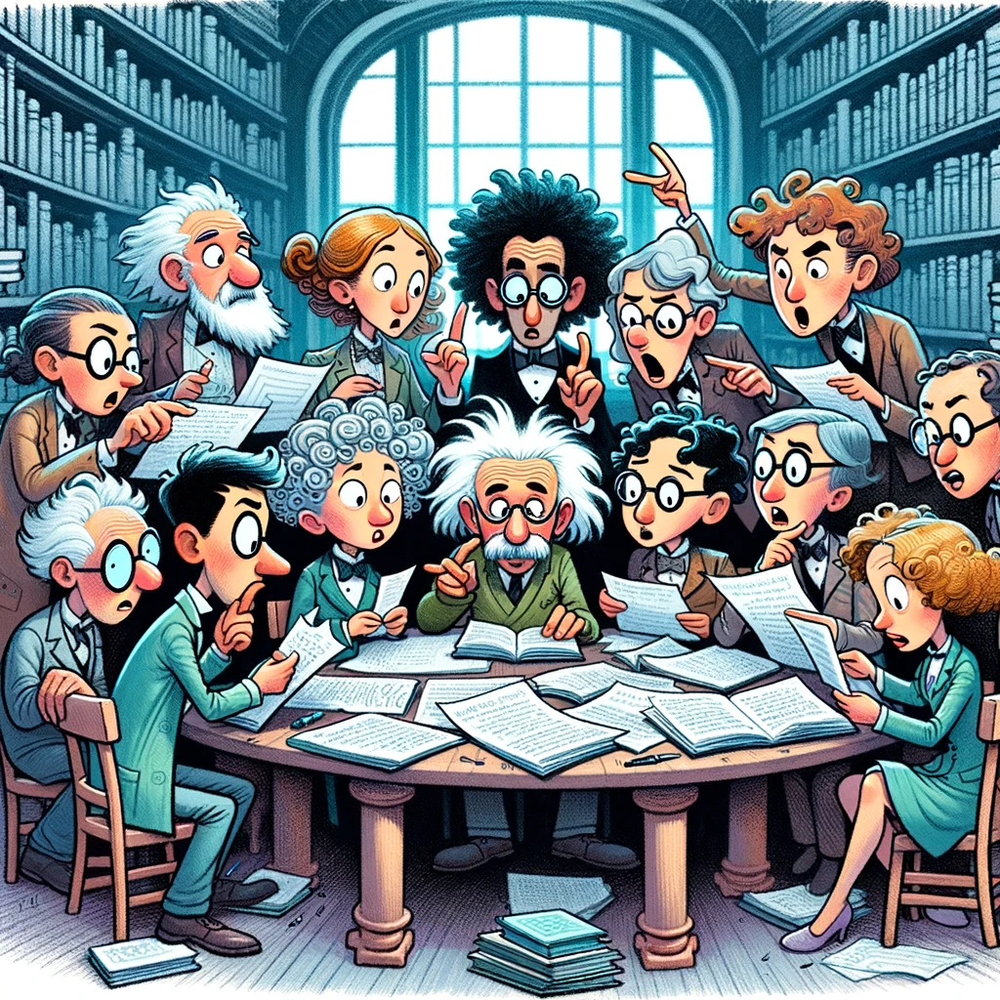

As a part of my team's regular activities we run a fortnightly scientific paper reading group. In this post I'd like to share how we operate our reading group, the challenges we've faced, and how we're currently overcoming them.

Running a paper reading group offers substantial benefits. It keeps us updated with the latest research, a crucial aspect in rapidly evolving scientific fields, such as Machine Learning. Regularly discussing scientific papers enhances critical thinking and analytical skills, but more important for me is that it fosters collaboration and effective communication within our team by encouraging the sharing of diverse ideas and perspectives.

I've also found that such reading groups help bridge the gap between theory and practical application, stimulates innovative thinking, and has lead to new research questions or experiments based on the discussions we'd during our reading groups.

## The Why

Our primary goal is to stay current with the rapid advancements in meteorology, in machine learning in earth science, and in forecast post-processing.

## The How

### Choosing the Right Papers

Selecting papers that cater to the diverse expertise levels within our team is a bit of a balancing act. We strive for papers that challenge us but are not overly difficult or too long to get through in an hour or so.

### Consistency and Flexibility

We meet bi-weekly, balancing the need for regular discussion with our already full schedules. We have a standing two hour MS Teams virtual meeting in everyone's calendars and the the meeting is structured in three parts:

1. Select a paper from the list - sometimes we vote if we're having trouble choosing.

2. Everyone goes off to read the paper on their own for an hour - I like to print it and take 'fleeting notes' on index cards as per the [Zettelkasten](https://en.wikipedia.org/wiki/Zettelkasten) method but many people are happy to read on their screen.

3. In the second hour we re-convene and share our likes, dislikes, misunderstandings, and questions. This discussion plays out organically - sometimes we use the whole hour other time we don't.

### Bridging Theory and Practice

One think i see happening again and again is people connecting the findings of the papers we read to our current research projects. We often come up with experiments to try and new methods to investigate.

## Hurdles

Maintaining a shared repository of papers and tracking what we have and haven't read has, surprisingly, proven challenging. We use digital tools like OneNote, but keeping these organized and up-to-date requires pretty regular attention. I've switched over to using an MS List table that is more like a database and can be updated and added to by anyone in the team much more easily, i'll report back.

We also invite colleagues from adjacent teams to join our reading group. While they were initially excited and showed up it quickly became difficult for them to prioritize and attendance by anyone but our core team has waned. I'm surprised how few teams or groups within my institute hold paper reading groups or paper discussions when the benefits are so large.

{width=300 fig-align="center"}

Running a paper reading group within our team has been a journey of continuous learning, discussion, and collaboration. As we continue to refine our approach we will continue to have a reading group as a core part of our team culture and drive for research excellence.

Thanks for reading.