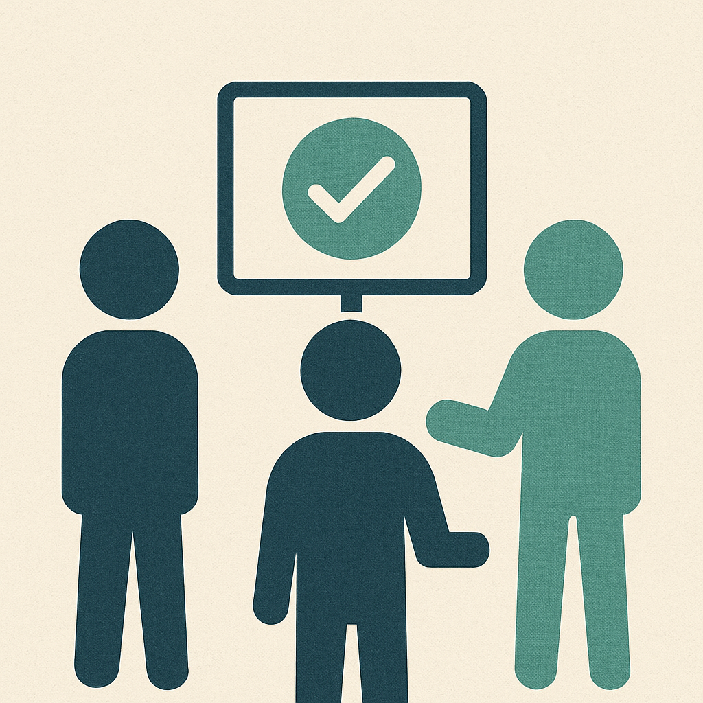

Looking back on my journey over the last few years, I've come to realise the nuanced complexities of team meetings, in particular the famous "stand-up". There was a time in my recent past when mandating stand-ups felt like an uphill battle, met with resistance and scepticism. This reflection has led me to consider three things that reshaped my perspective on stand-ups over the last year of so and i'd like to share them with you: "Walk the Board", "Impediments", and "Getting Out of The Way".

## Walking the Board: A Shift in Focus

Many stand up devolved into individual updates that overshadowed the collective progress towards our collective goals. This is when i tried "Walking the Board". This approach pivoted our focus from individual performances to revisiting our collective 'goal' for that day, week, month and on the tasks on the kanban board. It helped and I began to see enhanced collaboration as we talked through challenges and gaps together and there was a shift in meeting dynamics that allowed us to concentrate on our collective goal rather than individuals. This experience taught me the value of keeping shared goals front and center and of collective problem-solving.

## Identifying Impediments: Uncovering Hidden Challenges

I started asking "What is slowing you down?" and then waiting with my mouth firmly shut. This question became a catalyst and encouraged an environment where challenges were openly shared and addressed. This again focused us on helping each other and listening, which ultimately reduced the dependency on leaders to intervene.

By sitting (or standing...) with a potentially uncomfortable silence I observed my team evolve into a self-directed unit capable of overcoming impediments. It underscored the importance of empowering teams to find their own solutions as much as possible.

## Getting Out of The Way: Freedom to Choose

But, more than anything, my experience taught me that autonomy is key. Imposing stand-ups as mere status updates is counterproductive. Over time I am more and more embracing the ethos of Agile as articulated by [Allen Holub:](http://holub.com)

- Work small.

- Talk to each other.

- Make people's lives better.

This simple yet powerful philosophy helped me move beyond rigid structures to foster a truly agile and people-centric approach to my daily work.

{width=300 fig-align="center"}

## Conclusion

By giving teams the power to tailor their workflows, to focus on overcoming challenges together, and to make choices that enhance their own lives makes the workplace better and more effective for everyone.

Effective teams don't just follow methodologies - they adapt and evolve them to fit their unique needs and continuously improve their collaborative practices.

Thanks for reading.