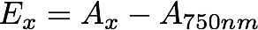

Chlorophyll a (chl) measurements are a useful estimate of algal biomass and have been used extensively for decades. Turner designs ([http://www.turnerdesigns.com/](http://www.turnerdesigns.com/) fluorometers are used extensively to quantify chl as they are fast, reliable, and relatively cheap. Nevertheless, errors can be introduced if the fluorometer isn't calibrated with a commercially available chlorophyll a standard (e.g. [crystallised Chlorophyll a from Anacystis nidulans algae from Sigma Chemical Company](http://www.sigmaaldrich.com/catalog/product/sigma/c6144?lang=en&region=AU)) regularly. The procedure described here is appropriate for algal chl in the marine environment. Scientists who employ this or other methods to measure pigments should make themselves aware of the issues that surround fluorescence based techniques and make appropriate decisions about the use of this technology for their application based on the scientific requirements and constraints of their individual programs.

## How often?
If used in the laboratory your fluorometer should be calibrated every 6 months. If the fluorometer is to be taken into the field then it should be calibrated before and after each voyage/expedition.

## Turner calibration
The method for calibrating a Turner fluorometer is quite straight forward and is well documented by Turner themselves. – [see this document for their 10-AU model](turner_cal_doc.pdf). The part that is not often documented is how do you independently determine the concentration of your chlorophyll standard in order to do this calibration in the first place. That is what I hope to show you how to do here.

### Spectophotometric estimation of chlorophyll concentrations
This is a brief method for estimating chlorophyll concentrations based on a samples spectral absorption, following [Jeffrey and Humphrey 1975](jeffreyhumphrey1975.pdf):

- Make up solutions of varying chlorophyll concentrations in 100% acetone (see [Jeffrey and Humphrey 1975](jeffreyhumphrey1975.pdf) for info on other solvents). I usually make three (a low, middle, and high concentration) for doing a calibration run.
- Using a UV/Vis spectrophotometer measure the absorption of your chlorophyll standard at 664nm, 647nm, 630nm, 750nm. I'll leave it up to you to work out how to make these measurements as all spectro's have different software etc etc...
- Calculate the extinction coefficients at 664nm, at 647nm, and at 630nm using the following eq:

where x denotes the wavelength of interest (e.g. 664 or 647 or 630nm), A is the absorption value, and E is the resulting extinction coefficient.

Using these extinction coefficients calculate chlorophyll a concentration using equation 4 from Jeffrey and Humphrey 1975 as follows:

where the resulting units are based on your abs measurement units but are likely to be ug/mL and so need to be converted to the more common ug/L. There are also equations for chl b and c should you be interested in them.

Now you know the chl concentration for each of your solutions you can now use this information to calibrate your Turner fluorometer.

Thanks for reading.

## Bibliography:
Jeffrey, SW T., and G. F. Humphrey. "New spectrophotometric equations for determining chlorophylls a, b, c1 and c2 in higher plants, algae and natural phytoplankton." Biochem Physiol Pflanz BPP (1975). [PDF](jeffreyhumphrey1975.pdf)